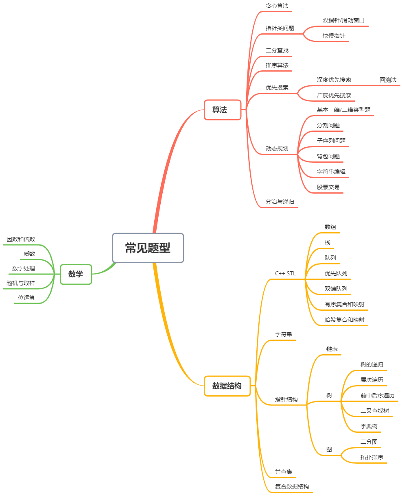

# LeetCode101

[金山文档 (kdocs.cn)](https://www.kdocs.cn/l/cgPuvwkcc2Lp)

永久免费网址：[changgyhub/leetcode_101: LeetCode 101：和你一起你轻松刷题（C++） (github.com)](https://github.com/changgyhub/leetcode_101/)


# 序

我在2018年这个秋天，去美国卡内基梅隆大学攻读硕士项目
整理LeetCode题目

在2019年秋季在GitHub上整理了初步总结，大约200道题目，用于自己的查缺补漏，但是被同学嘲笑后面没用了，所以想着帮助别人，所以决定将题目整理成书

书籍分为算法+数据结构，细分了十五个章节，共有101个题目，目的是不浪费读者的时间，但是如果只练习101道题，读者可能没有办法掌握核心科技，所以在每章的末尾，都会加上一些推荐的练习题并给出一些解法的提示。

本书以c++作为编程语言，对于java用户可以通过其他的方法去实现。适当地使用C++11语法

刷题是提高面试和工作能力的一笑部分，但是不能仅仅刷题，还需要提升其他的专业能力

# 1. 分类




按照题型分类：算法、数学、数据结构

算法：贪心算法、二分查找、排序、搜索、动态规划、分治
数学：优先放在其他部分
数据结构：STL常见的数据结构、字符串处理、链表、树、图、并查集和LRU


#  2. 贪心算法

## 2.1 算法解释

每次操作保证局部最优，最后全局最优

## 2.2 分配问题

**455 饼干分发问题(Easy)**

```C++
class Solution {
public:
    int findContentChildren(vector<int>& g, vector<int>& s) {
         sort(g.begin(),g.end());
         sort(s.begin(),s.end());
         size_t j = 0,cnt=0;
         for(auto g_i:g){
            if(j>=s.size()) return cnt;
            if(g_i<=s[j])
            {
                j++;
                cnt++;
            }else{
                while(++j<s.size() && g_i>s[j]);
                if(j>=s.size()) return cnt;
                j++;
                cnt++;
            }
         }

         return cnt;

    }
};
```

书籍提供的解法：

```C++
class Solution {
public:
    int findContentChildren(vector<int>& g, vector<int>& s) {
         sort(g.begin(),g.end());
         sort(s.begin(),s.end());
         size_t child=0,cookie=0;
         while(child<g.size() && cookie<s.size())
         {
             if(g[child]<=s[cookie]) child++;
             cookie++;
         }
         return child;
    }
};
```


**135 糖果问题(Hard)**