# 设计模式

[(46条消息) 认识 UML 类关系——依赖、关联、聚合、组合、泛化_恋喵大鲤鱼的博客-CSDN博客_依赖关系](https://blog.csdn.net/K346K346/article/details/59582926)

[快速记忆23种设计模式 - 知乎 (zhihu.com)](https://zhuanlan.zhihu.com/p/128145128)

# 0. 设计原则

总原则：开闭原则：指的是对扩展开放，对修改封闭

- 里氏替换原则：父类出现的地方，一定可以使用子类
- 依赖倒置原则：上层模块不依赖于底层，都应该依赖于抽象；抽象不依赖于细节，细节依赖于抽象
- 单一职责原则：一个类只能由一个发生变化的原因
- 接口隔离原则：客户端不能使用他不依赖的接口；类间的依赖关系建立在最小的接口上
- 合成复用原则:能用组合就不要
- 迪米特法则(最小知道原则)：一个类对依赖的类知道的越少越好


# 1. 创建型

对例的实例化过程进行了抽象，目的是为了将模块中对象的创建和使用分离开


工厂模式，抽象工厂模式，单例模式，建造者模式，原型模式


## 1.1 工厂模式


这里所有的product都要有个具体的创建工厂，product是一个返回值

## 1.2 抽象工厂模式


解决多种产品的问题，相比于简单工厂


## 1.3 单例模式


禁止构造函数，拷贝构造函数，需要上锁

```C++
class my_class;
my_class& get_my_class_instance() 
{
 static my_class instance; 
 return instance;
}
```

C++可以保证多个线程遇到静态变量时，只有一个进行了初始化


## 1.4 建造者模式

一个复杂的对象由多个复杂的部分构成，为了解耦各个部分的创建，保留一个稳定的创建过程，采用建造者模式

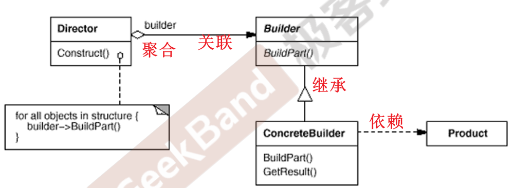

## 1.5 原型模式

对象拷贝一个相同的自己，包括运行时的状态

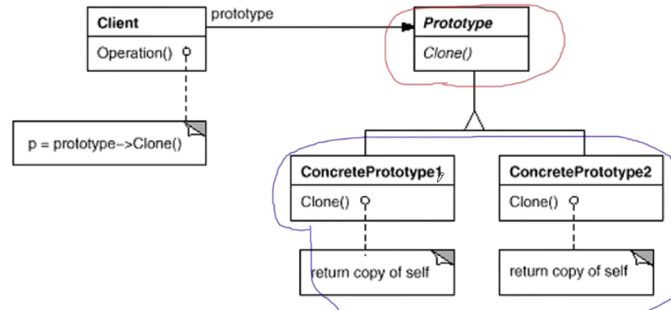


# 2. 结构型模式

对象之间相互直接依赖很困难，在中间加一个中间层，实现解耦合

关注对象的组成，以及对象之间的**依赖关系**，描述如何将对象组合起来，形成更大的结构

**接口隔离**：适配器模式、代理模式、外观模式
**单一职责**：装饰器模式、桥接模式
**数据结构模式**：组合模式

、享元模式

## 2.1 适配器模式

不修改旧类，在客户端和旧类之间搭建一个接口，实现对接口类型的转化

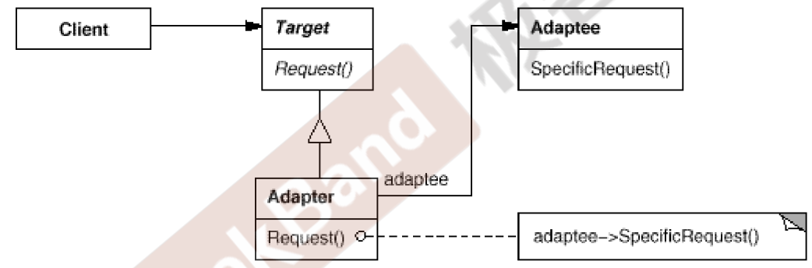


## 2.2 代理模式

需要访问某个对象的一些部分，需要控制访问权限啥的，不适合直接访问

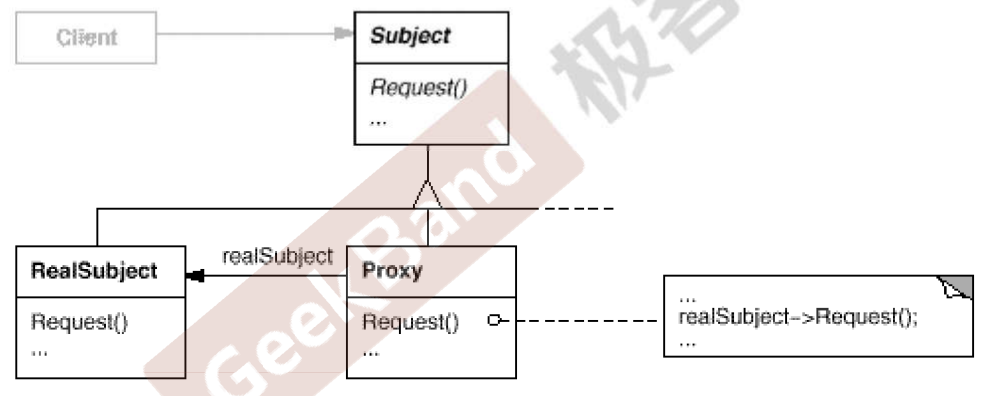


## 2.3 外观模式

强调的对整个系统的接口简化，强调对整个系统的简化，而不是对某个类

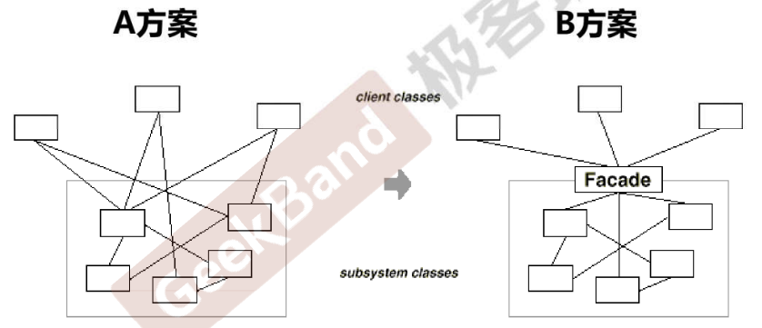

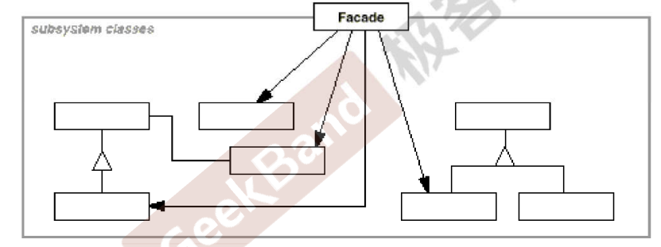


## 2.4 装饰器模式

希望对对象的功能实现动态的拓展：需要的时候加上，不需要的时候就不加，同时不修改原来的代码

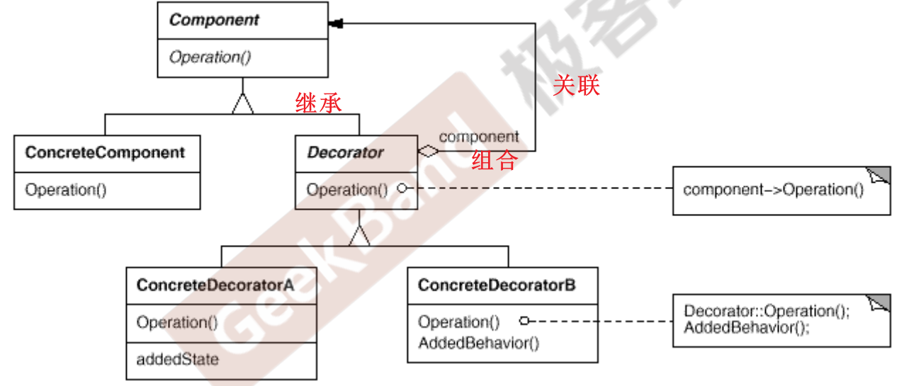

这里面举的例子，就是流基类，文件流，网络流

可能后面需要加密啥的


## 2.5 桥接模式

解决多维度变化，例如颜色和形状的解耦合，使用对象的组合关系，解耦抽象与实现之间的绑定关系

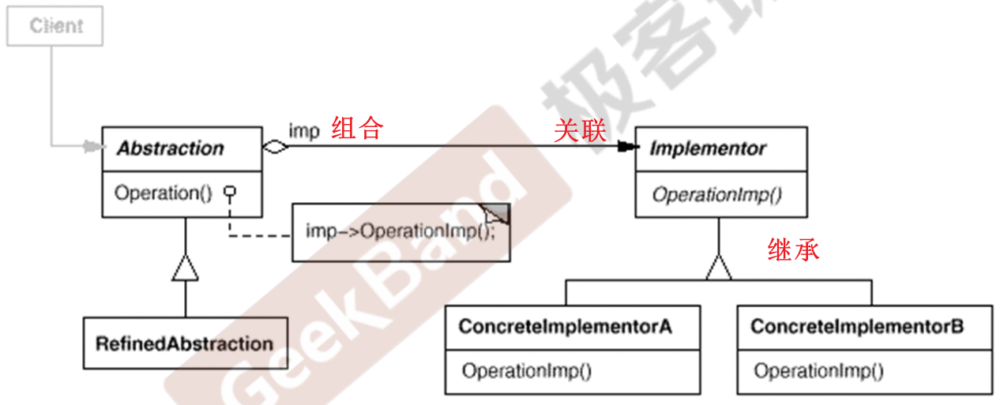

具体类就是 颜色类
Abstraction 就是 形状类


## 2.6 组合模式

客户端不能够过多依赖对象容器复杂的内部实现结构，对象容器内部实现结构的变化将引起客户代码的频繁变化


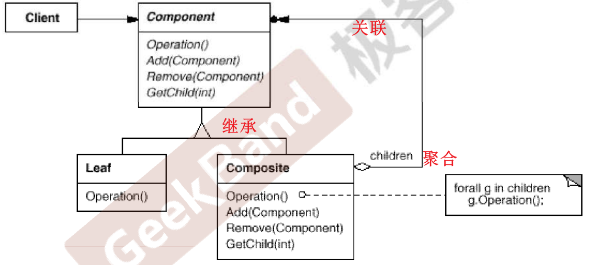

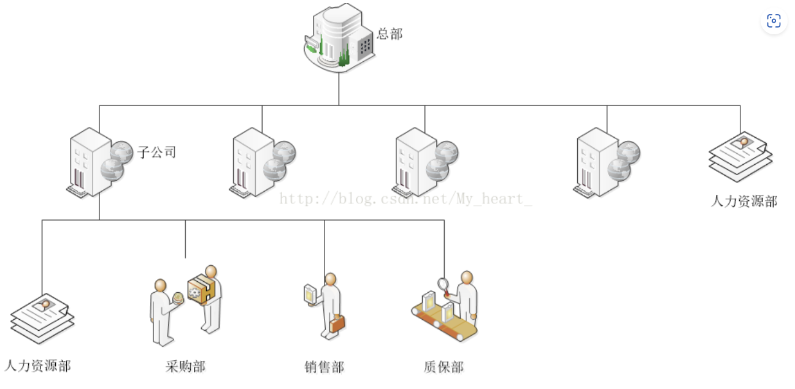

目的是为了表达一种整体局部的关系


## 2.7 享元模式

为了解决系统中对象太多，消耗了很多的内存，但是这些对象实例的某些数据成员具有一致的数据状态，那么就让这些对象共享数据状态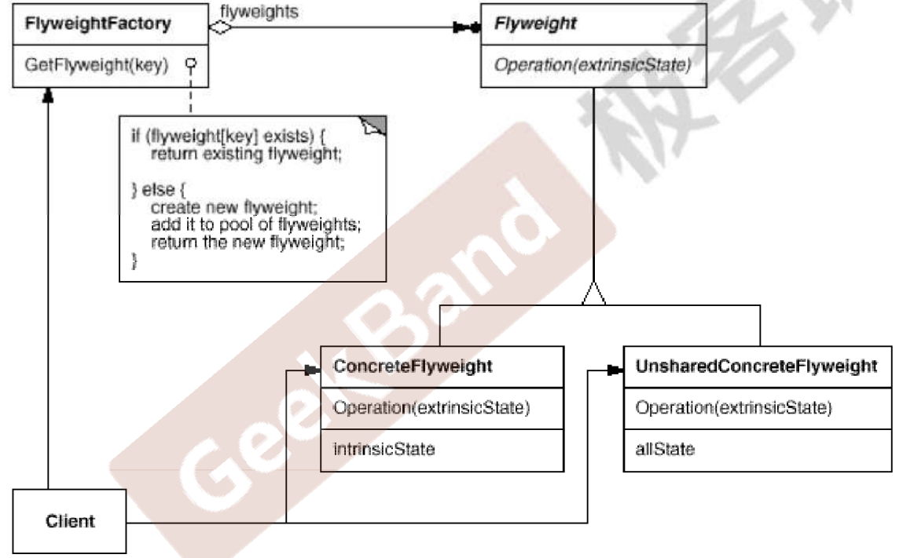


# 3. 行为型模式

描述的是对象的行为问题，是在不同对象间划分责任和算法的抽象化；不仅仅关注类和对象的结构，而且关注他们的相互作用


**组件协作**：策略模式、模板方法、观察者模式

、迭代器模式、责任链模式、命令模式、备忘录模式、状态模式、访问者模式、中介者模式、解释器模式


## 3.1 策略模式

某些对象的算法可能多种多样，经常改动，但是不可能将算法全部写到对象中，需要透明的修改对象的实现算法

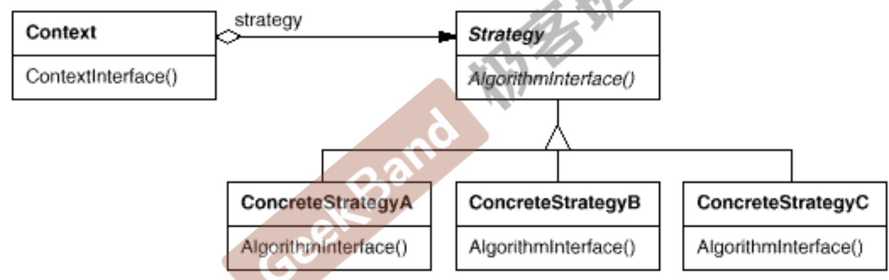

- 可以为子类提供可重用的算法，实现在类型运行时根据需要在各个算法之间切换
- 消除条件判断语句
- 实例中，没有数据成员，节省开销

不同国家的税率计算

## 3.2 模板方法


## 3.3 观察者模式

允许定义一个订阅机制，在对象的事件发生时通知多个对象


