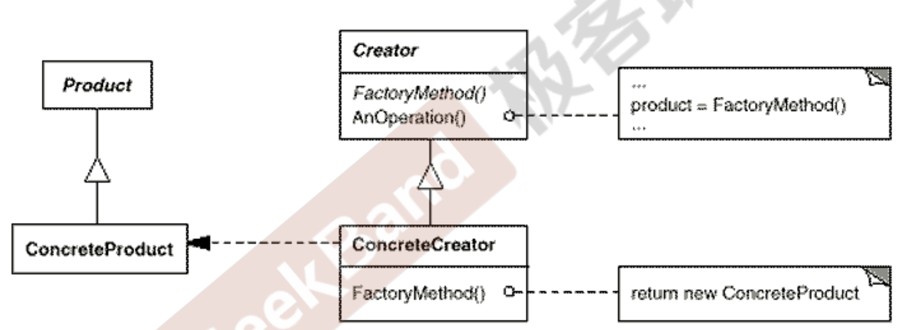
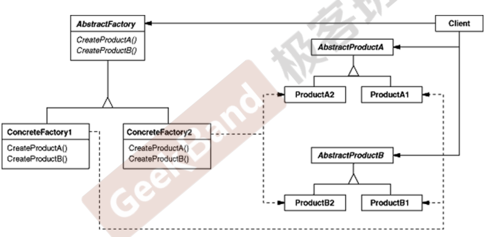
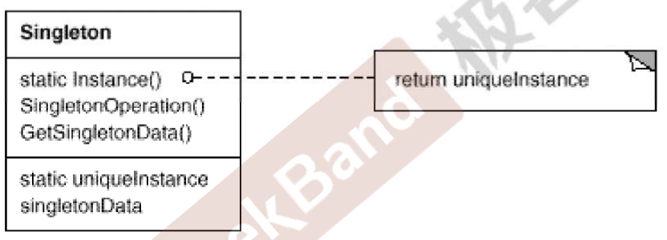

# 设计模式


# 0. 设计原则

总原则：开闭原则：指的是对扩展开放，对修改封闭

- 里氏替换原则：父类出现的地方，一定可以使用子类
- 依赖倒置原则：上层模块不依赖于底层，都应该依赖于抽象；抽象不依赖于细节，细节依赖于抽象
- 单一职责原则：一个类只能由一个发生变化的原因
- 接口隔离原则：客户端不能使用他不依赖的接口；类间的依赖关系建立在最小的接口上
- 合成复用原则:能用组合就不要
- 迪米特法则(最小知道原则)：一个类对依赖的类知道的越少越好


# 1. 创建型

对例的实例化过程进行了抽象，目的是为了将模块中对象的创建和使用分离开


工厂模式，抽象工厂模式，单例模式，建造者模式，原型模式


## 1.1 工厂模式



这里所有的product都要有个具体的创建工厂，product是一个返回值

## 1.2 抽象工厂模式



解决多种产品的问题，相比于简单工厂


## 1.3 单例模式




禁止构造函数，拷贝构造函数，需要上锁

```C++
class my_class;
my_class& get_my_class_instance() 
{
 static my_class instance; 
 return instance;
}
```

C++可以保证多个线程遇到静态变量时，只有一个进行了初始化


## 1.4 建造者模式


# 2. 结构型模式

关注对象的组成，以及对象之间的**依赖关系**，描述如何将对象组合起来，形成更大的结构

适配器模式、代理模式、装饰器模式、外观模式、桥接模式、组合模式、享元模式


# 3. 行为型模式

描述的是对象的行为问题，是在不同对象间划分责任和算法的抽象化；不仅仅关注类和对象的结构，而且关注他们的相互作用

策略模式、模板方法、观察者模式、迭代器模式、责任链模式、命令模式、备忘录模式、状态模式、访问者模式、中介者模式、解释器模式


